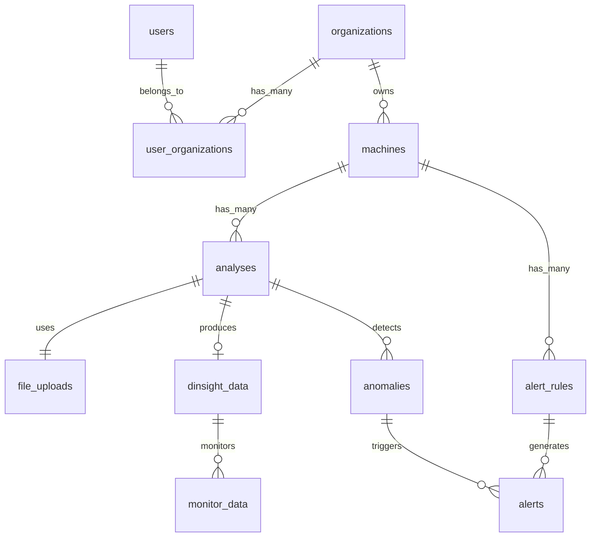

# 🗄️ Database Schema Specification

> **Version**: 2.0.0  
> **Database**: PostgreSQL 14+  
> **Status**: Partially Implemented

## 📋 Overview

PostgreSQL database schema for the DInsight predictive maintenance platform. The schema supports multi-tenant operations, time-series data, and complex analytical computations.

## 🔧 Database Configuration

```yaml
Database: PostgreSQL 14+
Extensions:
  - uuid-ossp (UUID generation)
  - pgcrypto (encryption)
  - timescaledb (time-series optimization)
  - pg_stat_statements (performance monitoring)
```

## 📊 Current Schema (Implemented)

### file_uploads
Tracks uploaded CSV files and their processing status.

```sql
CREATE TABLE file_uploads (
    id UUID PRIMARY KEY DEFAULT uuid_generate_v4(),
    original_filename VARCHAR(255) NOT NULL,
    file_size BIGINT NOT NULL,
    file_path VARCHAR(500),
    status VARCHAR(50) NOT NULL DEFAULT 'pending',
    error_message TEXT,
    merged_files JSONB,
    created_at TIMESTAMP WITH TIME ZONE DEFAULT CURRENT_TIMESTAMP,
    updated_at TIMESTAMP WITH TIME ZONE DEFAULT CURRENT_TIMESTAMP
);

CREATE INDEX idx_file_uploads_status ON file_uploads(status);
CREATE INDEX idx_file_uploads_created_at ON file_uploads(created_at);
```

### config_data
Stores processing configuration parameters.

```sql
CREATE TABLE config_data (
    id SERIAL PRIMARY KEY,
    -- Editable parameters
    gamma0 FLOAT NOT NULL DEFAULT 1e-7,
    optimizer VARCHAR(50) NOT NULL DEFAULT 'adam',
    alpha FLOAT NOT NULL DEFAULT 0.1,
    end_meta VARCHAR(255) NOT NULL DEFAULT 'participant',
    start_dim VARCHAR(255) NOT NULL DEFAULT 'f_0',
    end_dim VARCHAR(255) NOT NULL DEFAULT 'f_1023',
    -- Non-editable parameters (set by system)
    imax INTEGER NOT NULL DEFAULT 1000,
    lowdim INTEGER NOT NULL DEFAULT 2,
    eta FLOAT NOT NULL DEFAULT 0.5,
    epsilon FLOAT NOT NULL DEFAULT 1e-8,
    beta1 FLOAT NOT NULL DEFAULT 0.9,
    beta2 FLOAT NOT NULL DEFAULT 0.999,
    beta FLOAT NOT NULL DEFAULT 0.5,
    a FLOAT NOT NULL DEFAULT 0.8,
    w1 FLOAT NOT NULL DEFAULT 0.04,
    w2 FLOAT NOT NULL DEFAULT 1,
    which_w1 VARCHAR(50) NOT NULL DEFAULT 'auto',
    mode VARCHAR(50) NOT NULL DEFAULT 'kanadaSan',
    param_mode FLOAT NOT NULL DEFAULT 0.3,
    created_at TIMESTAMP WITH TIME ZONE DEFAULT CURRENT_TIMESTAMP
);

CREATE INDEX idx_config_data_created_at ON config_data(created_at DESC);
```

### dinsight_data
Stores processed dimensionality reduction results.

```sql
CREATE TABLE dinsight_data (
    id UUID PRIMARY KEY DEFAULT uuid_generate_v4(),
    file_upload_id UUID NOT NULL REFERENCES file_uploads(id),
    config_id INTEGER NOT NULL REFERENCES config_data(id),
    x_values FLOAT[] NOT NULL,
    y_values FLOAT[] NOT NULL,
    created_at TIMESTAMP WITH TIME ZONE DEFAULT CURRENT_TIMESTAMP
);

CREATE INDEX idx_dinsight_data_file_upload ON dinsight_data(file_upload_id);
CREATE INDEX idx_dinsight_data_config ON dinsight_data(config_id);
```

### feature_data
Stores feature values extracted during processing.

```sql
CREATE TABLE feature_data (
    id UUID PRIMARY KEY DEFAULT uuid_generate_v4(),
    file_upload_id UUID NOT NULL REFERENCES file_uploads(id),
    feature_values FLOAT[][] NOT NULL,
    metadata JSONB,
    created_at TIMESTAMP WITH TIME ZONE DEFAULT CURRENT_TIMESTAMP
);

CREATE INDEX idx_feature_data_file_upload ON feature_data(file_upload_id);
```

### monitor_data
Stores monitoring results and anomaly detection data.

```sql
CREATE TABLE monitor_data (
    id UUID PRIMARY KEY DEFAULT uuid_generate_v4(),
    dinsight_id UUID NOT NULL REFERENCES dinsight_data(id),
    monitor_values FLOAT[] NOT NULL,
    x_values FLOAT[] NOT NULL,
    y_values FLOAT[] NOT NULL,
    metadata JSONB,
    process_order INTEGER NOT NULL,
    created_at TIMESTAMP WITH TIME ZONE DEFAULT CURRENT_TIMESTAMP
);

CREATE INDEX idx_monitor_data_dinsight ON monitor_data(dinsight_id);
CREATE INDEX idx_monitor_data_process_order ON monitor_data(process_order);
```

## 🆕 New Schema (To Be Implemented)

### users
User account information.

```sql
CREATE TABLE users (
    id UUID PRIMARY KEY DEFAULT uuid_generate_v4(),
    email VARCHAR(255) UNIQUE NOT NULL,
    password_hash VARCHAR(255) NOT NULL,
    full_name VARCHAR(255) NOT NULL,
    role VARCHAR(50) NOT NULL DEFAULT 'user',
    is_active BOOLEAN DEFAULT true,
    email_verified BOOLEAN DEFAULT false,
    last_login TIMESTAMP WITH TIME ZONE,
    created_at TIMESTAMP WITH TIME ZONE DEFAULT CURRENT_TIMESTAMP,
    updated_at TIMESTAMP WITH TIME ZONE DEFAULT CURRENT_TIMESTAMP
);

CREATE INDEX idx_users_email ON users(email);
CREATE INDEX idx_users_role ON users(role);
```

### organizations
Multi-tenant organization support.

```sql
CREATE TABLE organizations (
    id UUID PRIMARY KEY DEFAULT uuid_generate_v4(),
    name VARCHAR(255) NOT NULL,
    slug VARCHAR(255) UNIQUE NOT NULL,
    description TEXT,
    industry VARCHAR(100),
    settings JSONB DEFAULT '{}',
    subscription_tier VARCHAR(50) DEFAULT 'free',
    is_active BOOLEAN DEFAULT true,
    created_at TIMESTAMP WITH TIME ZONE DEFAULT CURRENT_TIMESTAMP,
    updated_at TIMESTAMP WITH TIME ZONE DEFAULT CURRENT_TIMESTAMP
);

CREATE INDEX idx_organizations_slug ON organizations(slug);
```

### user_organizations
Many-to-many relationship for users and organizations.

```sql
CREATE TABLE user_organizations (
    id UUID PRIMARY KEY DEFAULT uuid_generate_v4(),
    user_id UUID NOT NULL REFERENCES users(id) ON DELETE CASCADE,
    organization_id UUID NOT NULL REFERENCES organizations(id) ON DELETE CASCADE,
    role VARCHAR(50) NOT NULL DEFAULT 'member',
    joined_at TIMESTAMP WITH TIME ZONE DEFAULT CURRENT_TIMESTAMP,
    UNIQUE(user_id, organization_id)
);

CREATE INDEX idx_user_organizations_user ON user_organizations(user_id);
CREATE INDEX idx_user_organizations_org ON user_organizations(organization_id);
```

### machines
Equipment/machine registry.

```sql
CREATE TABLE machines (
    id UUID PRIMARY KEY DEFAULT uuid_generate_v4(),
    organization_id UUID NOT NULL REFERENCES organizations(id) ON DELETE CASCADE,
    name VARCHAR(255) NOT NULL,
    model VARCHAR(255),
    serial_number VARCHAR(255),
    location VARCHAR(500),
    status VARCHAR(50) DEFAULT 'active',
    metadata JSONB DEFAULT '{}',
    last_analysis_at TIMESTAMP WITH TIME ZONE,
    created_at TIMESTAMP WITH TIME ZONE DEFAULT CURRENT_TIMESTAMP,
    updated_at TIMESTAMP WITH TIME ZONE DEFAULT CURRENT_TIMESTAMP
);

CREATE INDEX idx_machines_organization ON machines(organization_id);
CREATE INDEX idx_machines_status ON machines(status);
```

### analyses
Links file uploads and processing to specific machines.

```sql
CREATE TABLE analyses (
    id UUID PRIMARY KEY DEFAULT uuid_generate_v4(),
    machine_id UUID NOT NULL REFERENCES machines(id) ON DELETE CASCADE,
    file_upload_id UUID NOT NULL REFERENCES file_uploads(id),
    dinsight_id UUID REFERENCES dinsight_data(id),
    analysis_type VARCHAR(50) NOT NULL,
    status VARCHAR(50) NOT NULL DEFAULT 'pending',
    results JSONB,
    created_by UUID NOT NULL REFERENCES users(id),
    created_at TIMESTAMP WITH TIME ZONE DEFAULT CURRENT_TIMESTAMP,
    completed_at TIMESTAMP WITH TIME ZONE
);

CREATE INDEX idx_analyses_machine ON analyses(machine_id);
CREATE INDEX idx_analyses_status ON analyses(status);
CREATE INDEX idx_analyses_created_at ON analyses(created_at DESC);
```

### anomalies
Detected anomalies from monitoring.

```sql
CREATE TABLE anomalies (
    id UUID PRIMARY KEY DEFAULT uuid_generate_v4(),
    analysis_id UUID NOT NULL REFERENCES analyses(id) ON DELETE CASCADE,
    machine_id UUID NOT NULL REFERENCES machines(id),
    timestamp TIMESTAMP WITH TIME ZONE NOT NULL,
    severity VARCHAR(20) NOT NULL,
    distance FLOAT NOT NULL,
    threshold FLOAT NOT NULL,
    features JSONB NOT NULL,
    metadata JSONB,
    acknowledged BOOLEAN DEFAULT false,
    acknowledged_by UUID REFERENCES users(id),
    acknowledged_at TIMESTAMP WITH TIME ZONE,
    created_at TIMESTAMP WITH TIME ZONE DEFAULT CURRENT_TIMESTAMP
);

CREATE INDEX idx_anomalies_analysis ON anomalies(analysis_id);
CREATE INDEX idx_anomalies_machine ON anomalies(machine_id);
CREATE INDEX idx_anomalies_timestamp ON anomalies(timestamp DESC);
CREATE INDEX idx_anomalies_severity ON anomalies(severity);
CREATE INDEX idx_anomalies_acknowledged ON anomalies(acknowledged);
```

### alert_rules
Configurable alert conditions.

```sql
CREATE TABLE alert_rules (
    id UUID PRIMARY KEY DEFAULT uuid_generate_v4(),
    machine_id UUID NOT NULL REFERENCES machines(id) ON DELETE CASCADE,
    name VARCHAR(255) NOT NULL,
    condition JSONB NOT NULL,
    actions JSONB NOT NULL,
    severity VARCHAR(20) NOT NULL,
    is_active BOOLEAN DEFAULT true,
    created_by UUID NOT NULL REFERENCES users(id),
    created_at TIMESTAMP WITH TIME ZONE DEFAULT CURRENT_TIMESTAMP,
    updated_at TIMESTAMP WITH TIME ZONE DEFAULT CURRENT_TIMESTAMP
);

CREATE INDEX idx_alert_rules_machine ON alert_rules(machine_id);
CREATE INDEX idx_alert_rules_active ON alert_rules(is_active);
```

### alerts
Alert instances generated from rules.

```sql
CREATE TABLE alerts (
    id UUID PRIMARY KEY DEFAULT uuid_generate_v4(),
    alert_rule_id UUID NOT NULL REFERENCES alert_rules(id),
    machine_id UUID NOT NULL REFERENCES machines(id),
    anomaly_id UUID REFERENCES anomalies(id),
    status VARCHAR(50) NOT NULL DEFAULT 'active',
    data JSONB NOT NULL,
    acknowledged_by UUID REFERENCES users(id),
    acknowledged_at TIMESTAMP WITH TIME ZONE,
    resolved_by UUID REFERENCES users(id),
    resolved_at TIMESTAMP WITH TIME ZONE,
    created_at TIMESTAMP WITH TIME ZONE DEFAULT CURRENT_TIMESTAMP
);

CREATE INDEX idx_alerts_rule ON alerts(alert_rule_id);
CREATE INDEX idx_alerts_machine ON alerts(machine_id);
CREATE INDEX idx_alerts_status ON alerts(status);
CREATE INDEX idx_alerts_created_at ON alerts(created_at DESC);
```

### refresh_tokens
JWT refresh token storage.

```sql
CREATE TABLE refresh_tokens (
    id UUID PRIMARY KEY DEFAULT uuid_generate_v4(),
    user_id UUID NOT NULL REFERENCES users(id) ON DELETE CASCADE,
    token_hash VARCHAR(255) UNIQUE NOT NULL,
    expires_at TIMESTAMP WITH TIME ZONE NOT NULL,
    created_at TIMESTAMP WITH TIME ZONE DEFAULT CURRENT_TIMESTAMP
);

CREATE INDEX idx_refresh_tokens_user ON refresh_tokens(user_id);
CREATE INDEX idx_refresh_tokens_expires ON refresh_tokens(expires_at);
```

### audit_logs
System audit trail.

```sql
CREATE TABLE audit_logs (
    id UUID PRIMARY KEY DEFAULT uuid_generate_v4(),
    user_id UUID REFERENCES users(id),
    organization_id UUID REFERENCES organizations(id),
    action VARCHAR(100) NOT NULL,
    resource_type VARCHAR(50),
    resource_id UUID,
    changes JSONB,
    ip_address INET,
    user_agent TEXT,
    created_at TIMESTAMP WITH TIME ZONE DEFAULT CURRENT_TIMESTAMP
);

CREATE INDEX idx_audit_logs_user ON audit_logs(user_id);
CREATE INDEX idx_audit_logs_organization ON audit_logs(organization_id);
CREATE INDEX idx_audit_logs_action ON audit_logs(action);
CREATE INDEX idx_audit_logs_created_at ON audit_logs(created_at DESC);
```

## 🔄 Migration Strategy

### Phase 1: Authentication & Organizations
1. Create users table
2. Create organizations table
3. Create user_organizations table
4. Create refresh_tokens table
5. Migrate existing data to default organization

### Phase 2: Machine Management
1. Create machines table
2. Create analyses table
3. Link existing file_uploads to machines via analyses

### Phase 3: Anomaly Detection
1. Create anomalies table
2. Create alert_rules table
3. Create alerts table

### Phase 4: Audit & Optimization
1. Create audit_logs table
2. Add TimescaleDB hypertables for time-series data
3. Create materialized views for performance

## 🔍 Key Relationships



## 📈 Performance Considerations

### Indexes
- Primary keys on all tables
- Foreign key indexes for joins
- Timestamp indexes for time-based queries
- Status indexes for filtering
- Composite indexes for common query patterns

### Partitioning
- Partition anomalies table by month
- Partition audit_logs table by month
- Consider partitioning monitor_data by machine_id

### Data Retention
- Archive analyses older than 1 year
- Delete audit_logs older than 2 years
- Compress monitor_data older than 6 months

## 🔐 Security

### Row Level Security (RLS)
Enable RLS on sensitive tables:
- organizations (users see only their orgs)
- machines (filtered by organization)
- analyses (filtered by organization)
- alerts (filtered by organization)

### Encryption
- Encrypt sensitive JSONB fields
- Use pgcrypto for password hashing
- Encrypt refresh tokens

### Backups
- Daily full backups
- Continuous WAL archiving
- Point-in-time recovery capability